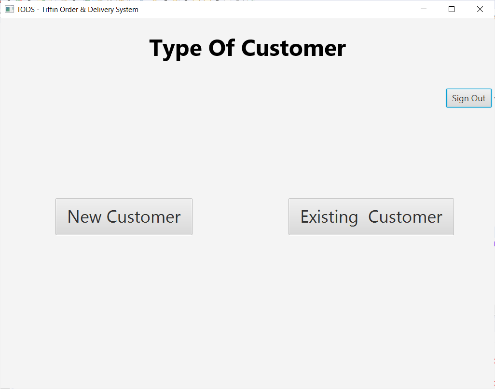
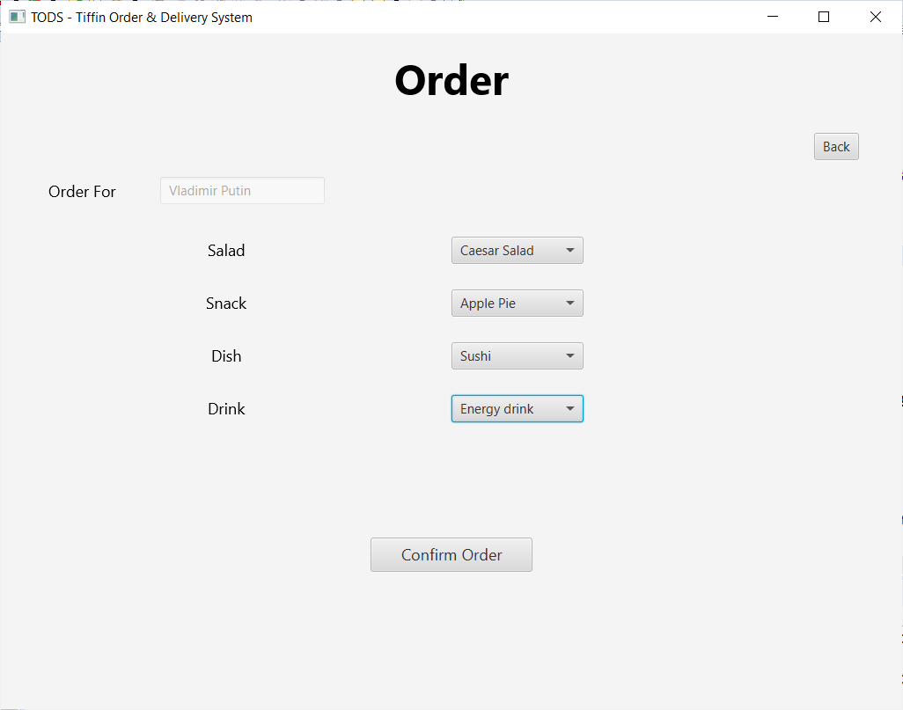

# This is the repository for the project "TODS - a Point of Sale system"

## TODS - Tiffin Order & Delivery System - is a POS system that allows the business to take orders and manage them efficiently. 
Employees will be able to:

    1. take and edit orders
    2. store the customer information and preferences into a database
    3. manage inventory
    4. make invoice

# Contributors:

   Sukhveer Sohi   [IamSohi](https://github.com/IamSohi)
   
   Gurkamal Bassi  [mrgarrybassi](https://github.com/mrgarrybassi)
   
   Prabhjot Saddi
   
# Techinologies Used:     
      
    Java Programming Language
    JavaFX Library
    MySQL
    Eclipse
    XAMPP
    SceneBuilder to create GUI
    
# Use Case Diagrams:
    
   

   
# Basic Tour:

    1.	Employee logs in.
    2.	An employee searches for existing customers by using their phone number or creates a new customer.
    3.	The employee creates an order and adds items into the order and completes the order.
    4.	Chef prepares the order.
    5.	Drivers log onto the system and collect orders for the school they are delivering to.
    6.	School accepts the orders from the driver and the driver distributes the orders to their respective recipients.
    
# JAVA Classes:

    Main class: 
        ●	MainApp.java

    Connection Class:
        ●	ConnectionUtil.java

    Controller Classes:
        ●	Controller.java
        ●	EmployeeLoginController.java
        ●	ChooseCustomerController.java
        ●	NewCustomerController.java
        ●	ExistingCustomerController.java
        ●	OrderController.java
        ●	OrderConfirmationController.java
        ●	EditOrderController.java
        ●	DriverController.java

    Model Classes:
        ●	Model.java
        ●	CustomerModel.java
        ●	DependantModel.java
        ●	EmployeeModel.java
        ●	OrderModel.java
        
# Test Results (Screenshots):

   &nbsp;
    
   &nbsp;
    
   &nbsp;
    
   &nbsp;
  
